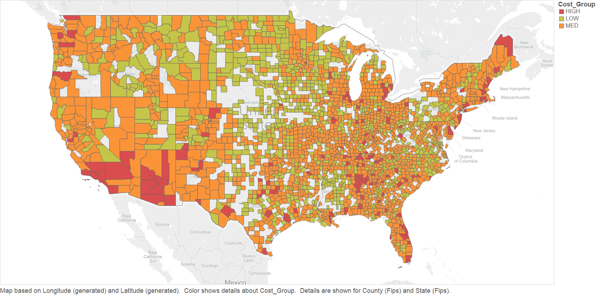
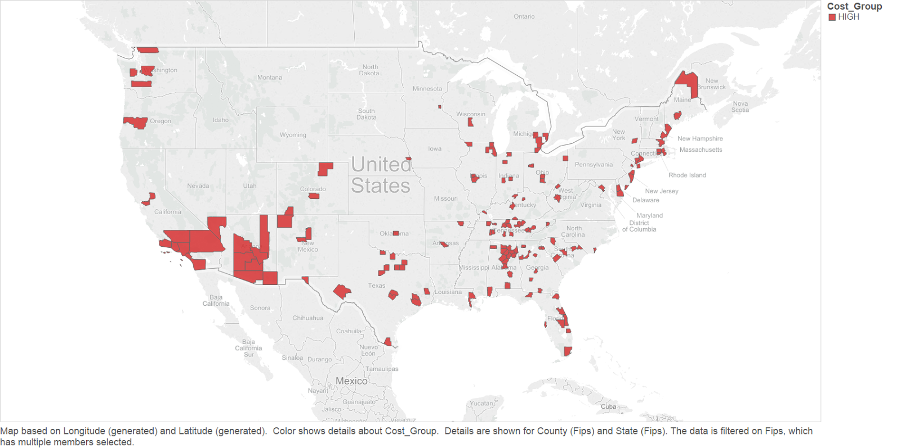
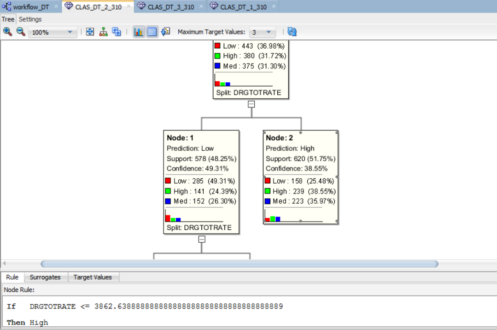
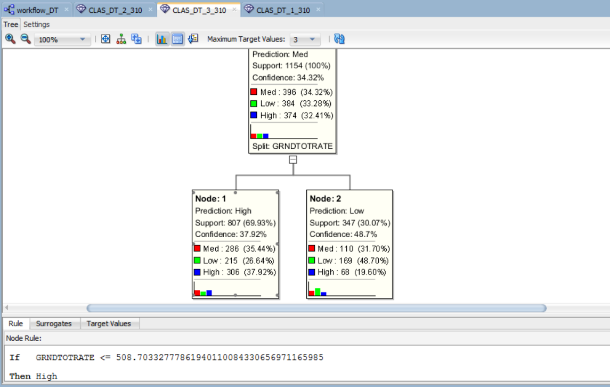
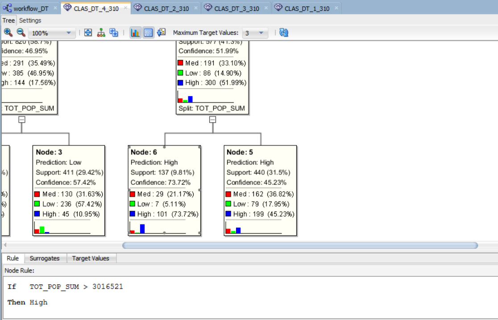
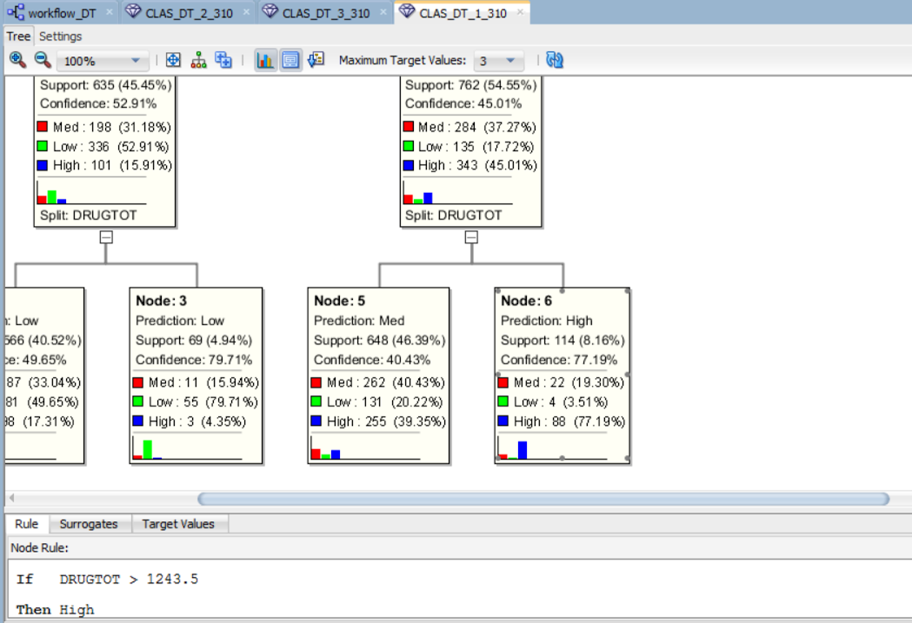
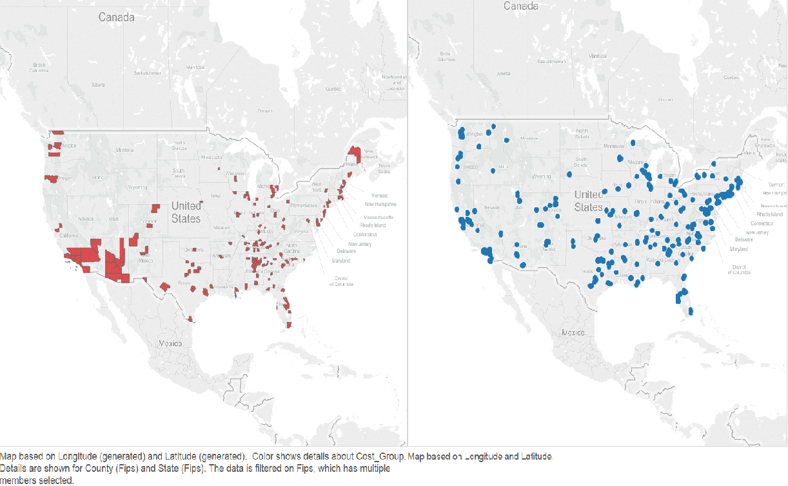

DoD 1033 Program Data Analysis
============


####About the 1033 Program:

The 1033 program was iniated in 1990 with the purpose of combating illegal drug activities using material not needed by the Department of Defense. Later, this was expanded to include efforts to combat terrorism as well.


####Our Conjecture:

Based on our initial study of the data and external sources such as [NPR](http://www.npr.org/2014/09/02/342494225/mraps-and-bayonets-what-we-know-about-the-pentagons-1033-program) and the [Associated Press](http://bigstory.ap.org/article/ap-impact-little-restraint-military-giveaways), our hypothesis was that through our analysis of the data we would find the 1033 Program to have failed its original purpose in appropriately aiding law enforcement agencies in the War on Drugs.


####The Data:

- [DoD 1033 Transactions, 2006-2014](https://drive.google.com/a/utexas.edu/#folders/0B03IIavLYTovdWg4NGtzSW9wb2c)
- [FBI Crime: Reported Arrests, 2010](http://www.icpsr.umich.edu/icpsrweb/NACJD/series/57/studies/33523?q=uniform+crime+reports%3A+county+level+detailed+2010&amp;searchSource=revise)
- [Census, 2010](https://www.census.gov/popest/data/counties/asrh/2013/CC-EST2013-ALLDATA.html)
- [Cato: Botched Raids Collection, 1989-2012](https://www.google.com/fusiontables/DataSource?docid=1fDfLN7YpE9H7gdGH0ePtJFbwpXy51juTv4-WI24#rows:id=1)


####1033 Program Data Transformation:

In order to do our predictive queries, we created a field to represent counties with high, medium or low amounts of 1033 program allocations.

```
High > $250,000
$250,000 >= Medium > $10,000
$10,000 >= Low
```




####Analysis of Combating Terrorism:

One of the purposes the 1033 Program is said to have adopted was to combat terrorism. Our method of analyzing whether it achieved this purpose was to take a look at places where terrorist attacks were more likely, such as coastal and border counties, and see if they received a greater amount from the 1033 Program.




####Analysis of Combating Drug Crime:

The original purpose of the 1033 Program was to distribute equipment in a way that would help fight drug crime. So our method of analyzing whether they achieved this was to use predictive queries on drug crime, crime overall, and population. We figured higher drug crime, higher crime, or higher population would warrant a larger amount from the 1033 program.


####Predictive Query on Crime Rates:

We ran predictive queries on how drug crime and overall crime rates affected the amount a county received from the 1033 Program. 

- Our results showed that there is a 38% confidence that higher drug crime rate indicated higher 1033 Program allocation... 




- ...and only 37% confidence that higher crime rate indicated higher 1033 Program allocation.




####Predictive Query on Population and Drug-related Crime Totals:

We also ran predictive queries on drug crime totals and population to see how these affected the 1033 Program allocation.

- Our results showed that for population there is a 74% confidence that if a county has over 3 million people, it was allocated a higher amount of 1033 Program equipment. 




- Our results also showed that drug crime totals told a different story than drug crime rates, giving a 77% 
confidence that a county with over 1243 drug crimes received a higher amount of 1033 Program equipment.




####Conclusions:

Based on our analysis of the data, we found that the 1033 Program materials were not necessarily allocated according to its original purpose. Though crime rate and border/coastal towns didn’t necessarily indicate more equipment, there seems to be a trend that the higher populated areas and areas with a higher total amount of drug crime received a greater amount. 


####Other Observations to Note:

We were able to acquire data related to botched paramilitary raids from the Cato Institute. This would represent instances of wrongful and mistaken force compiled over the past 25 years by crawling news sources across the nation. For now, we mapped the results(right) side-by-side with the 1033 Program high level allocation map(left). 




####Where We Go from Here:

- Exploring the consequences of giving military equipment to civilian institutions
- Exploring how much of this equipment is actually being used, and how much is sitting in warehouses
- Explore data by year
- Explore where the equipment went
